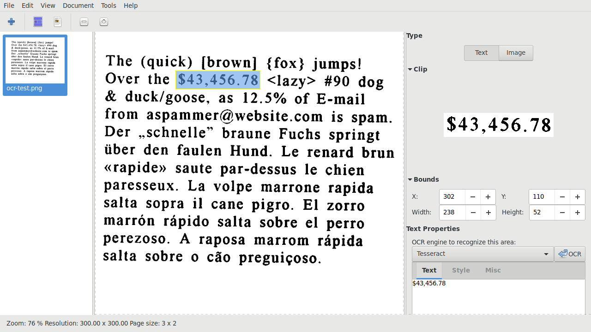

# ocrfeeder-flatpak

**OCRFeeder** is a complete Optical Character Recognition and Document Analysis and Recognition program.



[Homepage](https://wiki.gnome.org/Apps/OCRFeeder)

This repo is about the flatpak package.

## Instructions

### Requirements

* [flatpak](https://github.com/flatpak/flatpak)
* [flatpak-builder](https://github.com/flatpak/flatpak-builder)

For EL7:

```
# yum install 'flatpak' 'flatpak-builder'
```

You may also wish to install the `xdg-desktop-portal*` packages:

```
# yum install 'xdg-desktop-portal*'
```

See also:

* [flatpak setup](https://flatpak.org/setup)

### Adding repository

```
$ flatpak remote-add --if-not-exists "flathub" "https://dl.flathub.org/repo/flathub.flatpakrepo"
```

See also:

* [flathub setup](http://docs.flatpak.org/en/latest/using-flatpak.html#add-a-remote)

### Prepare

```
$ flatpak --user install "flathub" "org.gnome.Sdk//3.34"
```

```
$ flatpak --user install "flathub" "org.gnome.Platform//3.34"
```

Clone this repository, then checkout the right branch.

```
$ git submodule init
```

```
$ git submodule update
```

### Build

```
$ flatpak-builder "build" "org.gnome.OCRFeeder.yaml" --force-clean --install-deps-from="flathub"
```

### Test

```
$ flatpak-builder --run "build" "org.gnome.OCRFeeder.yaml" "sh"
```

### Test run

```
$ flatpak-builder --run "build" "org.gnome.OCRFeeder.yaml" "ocrfeeder"
```

### Create repo

```
$ flatpak-builder --repo="repo" --force-clean "build" "org.gnome.OCRFeeder.yaml"
```

### Install

```
$ flatpak --user remote-add --no-gpg-verify "ocrfeeder" "repo"
```

```
$ flatpak --user install "ocrfeeder" "org.gnome.OCRFeeder"
```

### Run

```
$ flatpak --user run "org.gnome.OCRFeeder"
```

### Uninstall

```
$ flatpak --user uninstall "org.gnome.OCRFeeder"
```

```
$ flatpak --user remote-delete "ocrfeeder"
```

### Build single-file bundle

```
$ flatpak build-bundle "repo" "ocrfeeder.flatpak" "org.gnome.OCRFeeder" --runtime-repo="https://flathub.org/repo/flathub.flatpakrepo"
```

### Install single-file bundle

If you have already [installed](#install) the package, you have to [uninstall](#uninstall) it before continuing.

```
$ flatpak --user install "ocrfeeder.flatpak"
```

See also:

* [Building your first Flatpak](http://docs.flatpak.org/en/latest/first-build.html)
* [Single-file bundles](http://docs.flatpak.org/en/latest/single-file-bundles.html#single-file-bundles)

## FAQ

### Why not a RPM package?

I already provided [COPR repo](https://copr.fedorainfracloud.org/coprs/scx/ocrfeeder) with (S)RPM packages for EL and Fedora.

### Why sandboxed OCRFeeder doesn't recognize my scanner, while it works flawless on the host?

Because flatpak doesn't have access to `sane` from the host. Currently, we basically need to include each `sane` backend in the flatpak package, which is insane to maintenance. I tried my best, but I am unable to support all [external backends](http://www.sane-project.org/lists/sane-backends-external.html). What's worse, a lot of them require an insane amount of patches. Even if somehow I managed to include them here, I have no way to test them all.

There are some plans to extend [xdg desktop portals](https://github.com/flatpak/xdg-desktop-portal/issues/13), or - to be more specific - add the [scanner portal](https://github.com/flatpak/xdg-desktop-portal/issues/218), so it would provide a sane way to access scanners.
Unfortunately, these are just plans. No one is currently working on it.
By the way, that's one of the main reasons why we don't have the flatpak package for [simple-scan](https://gitlab.gnome.org/GNOME/simple-scan/issues/21) yet.

However, there is a relatively easy way to access scanner via the `net` backend.
First of all, you have to install `saned` (`sane` daemon) on the host.

Instruction for EL7:

```
# yum install sane-backends
```

Instruction for EL8:

```
# yum install sane-backends-daemon
```

Instruction for Fedora:

```
# dnf install sane-backends-daemon
```

Instruction for Debian/Ubuntu:

```
# apt-cache update && apt-get install sane-utils
```

Then, make sure to add `localhost` to the `/etc/sane.d/saned.conf` file:

```
# grep '^[[:blank:]]*localhost[[:blank:]]*$' "/etc/sane.d/saned.conf" || echo 'localhost' >> "/etc/sane.d/saned.conf"
```

Finally, enable and start the `saned` service:

```
# systemctl enable saned.socket
```

```
# systemctl start saned.socket
```

Now you should be able to use your scanner in this flatpak package.

See also:

* [Similar tutorial for Paperwork](https://gitlab.gnome.org/World/OpenPaperwork/paperwork/blob/master/flatpak/README.markdown#quick-start)

### Are you the author of OCRFeeder?

No, I only created the flatpak package for it.

See also:

* [GitLab repo](https://gitlab.gnome.org/GNOME/ocrfeeder)

